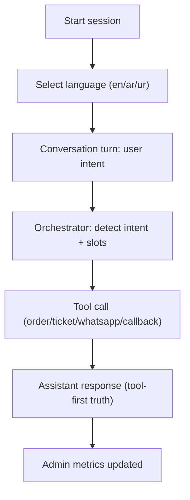

## 1. Product Overview
Demo MVP for a multilingual (language-first) conversational AI voice agent for e-commerce support with WhatsApp continuation, delivered first with simulated telephony and designed to later plug into customer-owned telephony platforms.
- Target users: e-commerce customers (callers), support agents (minimal), admins/supervisors
- Value: faster self-service for order tracking and common delivery issues, measurable containment, and clear operational visibility

## 2. Core Features
### 2.1 User Roles
| Role | Access Method | Core Permissions |
|------|---------------|------------------|
| Caller | Call simulator session | Select language, speak/type intent, receive answers, request WhatsApp/callback |
| Agent | Web UI | View tickets/callbacks, update statuses (minimal) |
| Admin | Web UI | View metrics, view records (sessions/tickets/callbacks/WhatsApp) |

### 2.2 Feature Modules
1. **Call Simulator**: language selection, multi-turn conversation, event log, suggested actions
2. **Conversation Orchestrator**: language lock, intent routing, tool-first truth enforcement, fallback/escalation
3. **Tools/Integrations**: order lookup, ticket create, callback create, WhatsApp send
4. **Admin Dashboard**: metrics and records for demo visibility

### 2.3 Page Details
| Page Name | Module Name | Feature description |
|-----------|-------------|---------------------|
| Call Simulator | Language selection | English/Arabic/Urdu selection first, lock session language |
| Call Simulator | Conversation | Typed input for stability; optional audio later |
| Call Simulator | Suggested actions | Buttons for “Continue on WhatsApp” and “Request callback” |
| Agent Desk | Worklist | View callbacks and tickets; update status |
| Admin Dashboard | Metrics | Total sessions, language split, containment, escalations, callbacks, tickets, WhatsApp sent |
| Admin Dashboard | Records | Sessions, turns, tickets, callbacks, WhatsApp message logs |

## 3. Core Process
Primary demo journeys:
- Order Tracking: language → “track my order” → provide order number/phone → tool lookup → status → send WhatsApp tracking link
- Delivery Issue: language → “item damaged” → collect details → tool create ticket → offer callback → callback created

## 4. User Interface Design
### 4.1 Design Style
- Primary colors: neutral dark UI with a single accent (configurable)
- Layout: 3-page app (Simulator, Agent Desk, Admin Dashboard)
- UI focus: clarity for live demos, event log visibility, fast interaction loops

### 4.2 Page Design Overview
| Page Name | Module Name | UI Elements |
|-----------|-------------|-------------|
| Call Simulator | Conversation panel | Transcript, input box, send button, optional audio controls |
| Call Simulator | Event log | Tool calls summary, timings, outcomes |
| Admin Dashboard | Metrics cards | Counts + language split + top intents |
| Admin Dashboard | Records table | Filterable list of sessions/tickets/callbacks |

### 4.3 Responsiveness
Desktop-first, mobile-adaptive for basic viewing.

