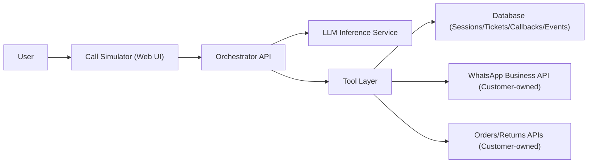
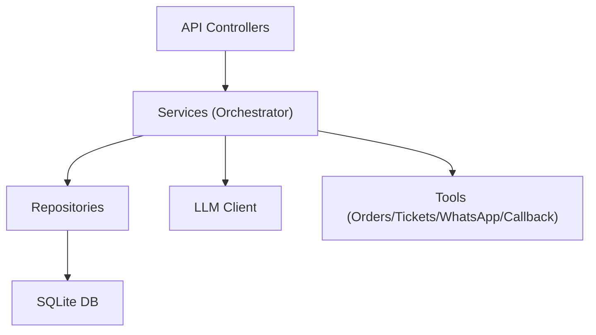
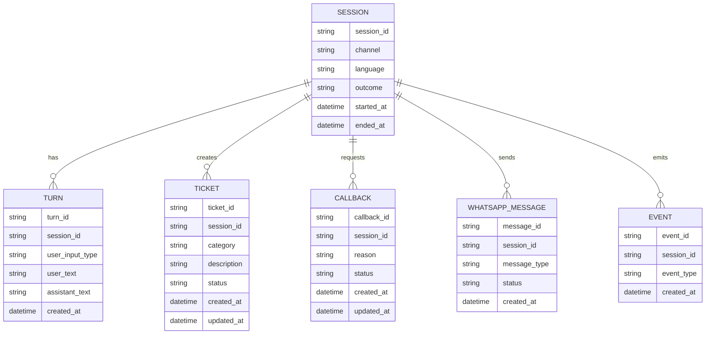

## 1. Architecture Design

## 2. Technology Description
- Frontend: React@18 + tailwindcss@3 + vite
- Initialization Tool: vite-init
- Backend: Express@4 (TypeScript, ESM)
- Database: SQLite for MVP demo (upgrade path to PostgreSQL)
- State: zustand for UI state where needed

## 3. Route Definitions
| Route | Purpose |
|-------|---------|
| / | Call Simulator |
| /agent | Agent Desk (minimal) |
| /admin | Admin Dashboard |

## 4. API Definitions
### 4.1 Sessions
- POST /api/sessions
  - Response: { session_id, next_prompt }
- POST /api/sessions/:sessionId/language
  - Body: { language: "en" | "ar" | "ur" }
- POST /api/sessions/:sessionId/turns
  - Body: { input_type: "text" | "dtmf" | "audio", text?: string, dtmf?: string }
  - Response: { assistant_text, events, suggested_actions }

### 4.2 Actions
- POST /api/sessions/:sessionId/callback
  - Body: { phone?: string, reason: string, preferred_time?: string }

### 4.3 Admin
- GET /api/admin/metrics
- GET /api/admin/records

## 5. Server Architecture Diagram

## 6. Data Model
### 6.1 Data Model Definition

### 6.2 Data Definition Language
For MVP, use SQLite migrations that create:
- sessions
- turns
- tickets
- callbacks
- whatsapp_messages
- events

